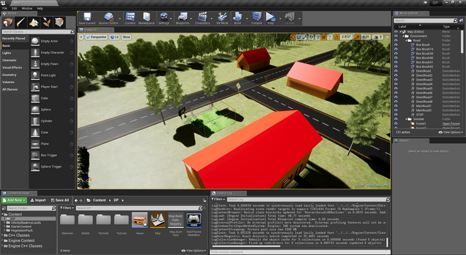
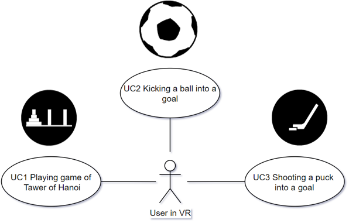
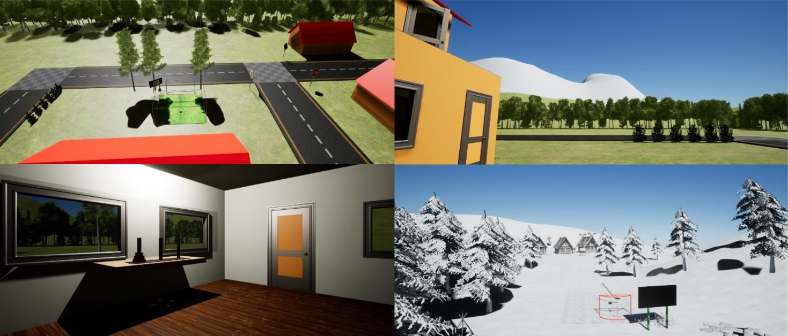

# Master's Thesis
# User Representation and Interaction in Virtual Reality Focusing on Presence

[Master's Thesis](http://opac.crzp.sk/?fn=*docview&linkage=338B0A90B1F6F09967035C3F5B1B82E696F9A659311A67C858A9EA7BD26F0936DEF37D771003C454D27167E9B633C323847047E37C1357&record=ABCEC5876A40CFC0D991D9344C66&bckLnk=7939C38F204B435FAA9528AF9FF99A05E1B6125E918C8DEA4B0CBB89EA5B61D4983157C9&sth=2B55FF0F18257B6FC170138D&mim=A1EBDA02D9AEA1)

[Appendix A: Evaluation of Work Plan](src/AppendixA.pdf)

[Appendix B: User Guide](src/AppendixB.pdf)

[Appendix C: Technical Documentation](src/AppendixC.pdf)

[Appendix D: Presence Questionaire](src/Questionaire.pdf)

Accessing devices for Virtual Reality becomes much and much easier and more affordable for large audience. In context of virtual reality, there are two important concepts – concept of immersion and concept of presence. Immersion is amount of sensory input provided by medium. Presence refers to psychological experience of “being there”.

Most of the current Virtual Reality solutions use some controller for user interaction and representation. User representation and interaction based on devices that provide natural user interface, namely Microsoft Kinect and Leap Motion Orion, have some advantages compared to controllers. Their main advantage is that they provide interaction technique with which user is familiar for whole life.

In this thesis we examine user representation and interaction in Virtual Reality based on MS Kinect and Leap Motion Orion data. 

We [implemented](src/AppendixC.pdf) user representation based on Kinect and Leap Motion Orion data. During implementation phase we discovered limitations of used technologies that affected user testing. We performed user testing focused on presence [presence](src/Questionaire.pdf) and performance.

## Implementation and Used Technologies: 
- C++ and Unreal Engine 4.18 (implementation)
- Microsoft Kinect v2 and Kinect for Windows SDK 2.0)
- Leap Motion and Leap Motion SDK)
- Oculus Rift DK2
- Blender 2.78b (custom 3D models)

## Unreal Engine 4.18 Project

## Use-cases / Mini Games: 

We implemented 3 interactive mini-games:
- Tower of Hanoy
- Kicking ball into a goal ("Football")
- Shooting puck into a goal ("Hockey")

Additionaly we implemented procedure for switching between mini-games without need of exiting Virtual Reality or closing the program

### Tower of Hanoi (UC1 Playing game of Tower of Hanoi)

### Football (UC2 Kicking ball into a goal)

### Hockey (UC3 Shooting a puck into a goal)

### Changing the location

## Virtual Environment

- house and Garden (left top) - "football" field

- view from view from "football" field to mountains (right top)

- VR room (left bottom) - Tower of Hanoi

- mountains (right bottom) - Hockey field

## Implementation
For more information about implementation see [8. Solution](src/8Solution.pdf) and [Appendix C: Technical Documentation](src/AppendixC.pdf)

